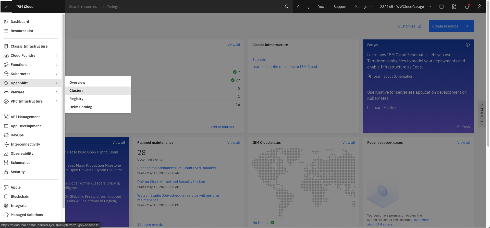
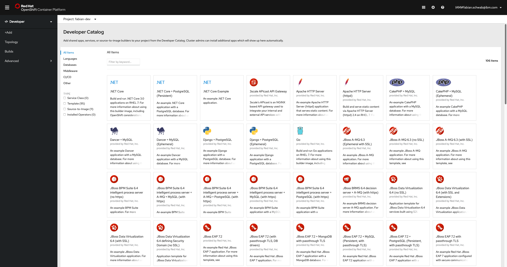
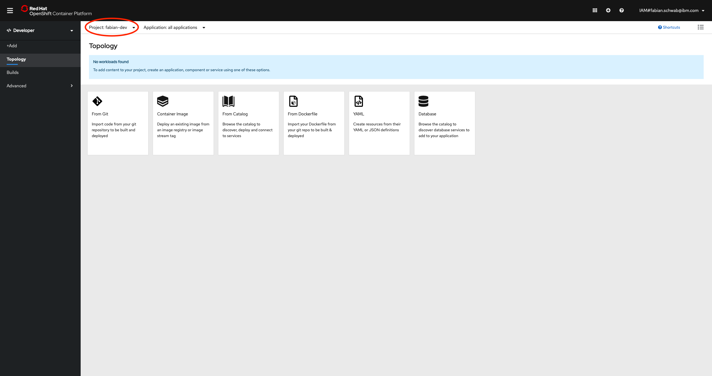
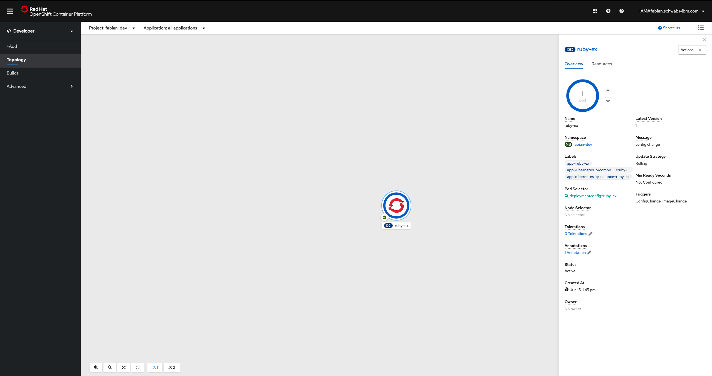
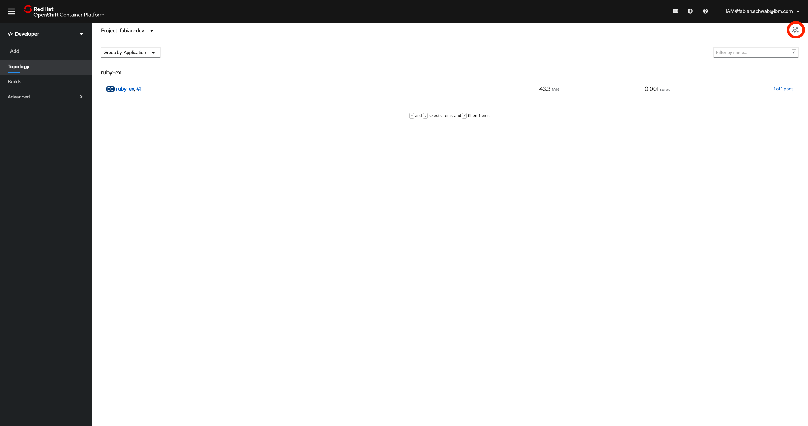
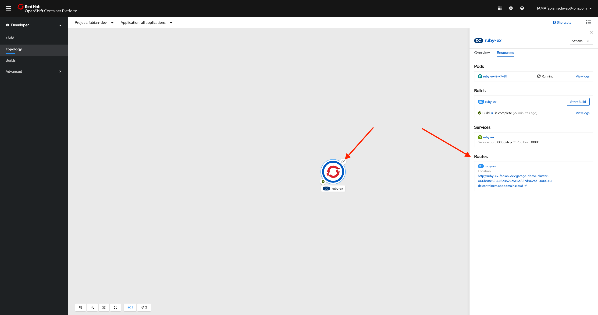

# Lab 1: Working with OpenShift 4.3

## Log into the cluster UI

Log into [IBM Cloud](https://cloud.ibm.com/login).

Navigate to **Menu** &rarr; **OpenShift** &rarr; **Clusters** as shown below and select a cluster



You should see the overview of the cluster, with a summary about the cluster, worker node status and some cluster insights.

Explore the tabs **Access**, **Worker Nodes** and **Worker Pools**:

- `Access` contains information on how to access the cluster.
- `Worker Nodes` shows a list of virtual servers, the cluster runs on, with status information
- `Worker Pools` shows a list of worder node pools.

To guarantee reliability, availability and low latency the cluster can be scaled over different worker pools in different locations, where each worker pool has multiple worker nodes.

Next, open the **OpenShift Web Console**, by clicking on the blue button on the top right.

You should be presented the OpenShift landing page:

Depending on the rights you have, you should be able to switch between `Administrator` and `Developer` view in first menu entry on the left.  
In most cases you start with the `Developer` view and `Topology` view. Where you can see all applications in the cluster, if there are any.


Select the first entry in the menu **+Add** and click the card named **From Catalog**:



Explore the tabs **Languages**, **Databases**, **Middleware**, **CI/CD**, **Other** of the catalog:

- `Languages` contains a list of available run times, starter packs and examples per language.
- `Databases` shows a list of databases, available in OpenShift.
- `Middleware` shows a list of middleware services.
- `CI/CD` contains options for CI/CD tooling.
- `Other` available software to install.

The catalog items can be extended by the cluster administrator.

## Log into the cluster with the CLI

Now let's log into the cluster with the cli to perform the first operations on the cluster.

Therefore, click on your name in the top right corner and then select **Copy Login Command** and click **Display token**. Copy the command below `Log in with this token`.  
Open up a local terminal, paste the login command and execute it. You are presented a list of projects.

```bash
$ oc login https://... --token=XXX

Logged into "https://c100-e.eu-de.containers.cloud.ibm.com:30026" as "IAM#<your account>" using the token provided.

You have access to '<number of projects>' projects, the list has been suppressed. You can list all projects with 'oc projects'

Using project "default".
```

Validate the login:

```bash
$ oc whoami

IAM<your name>
```

Now let's explore the cli a little bit:

```bash
oc --help
```

## Create a new project

In OpenShift all resources and deployments are grouped into projects. Let's create our own project:

```bash
$ oc new-project <your name>-dev


Now using project "<your name>-dev" on server "https://c100-e.eu-de.containers.cloud.ibm.com:31192".

You can add applications to this project with the 'new-app' command. For example, try:

    oc new-app django-psql-example

to build a new example application in Python. Or use kubectl to deploy a simple Kubernetes application:

    kubectl create deployment hello-node --image=gcr.io/hello-minikube-zero-install/hello-node
```

Validate that the project has been created by displaying a list of projects:

```bash
$ oc projects

You have access to the following projects and can switch between them with 'oc project <projectname>':

    default
    ibm-cert-store
    ibm-system
    kube-proxy-and-dns
    kube-public
    kube-service-catalog
    kube-system
    openshift
    openshift-ansible-service-broker
    openshift-console
    openshift-infra
    openshift-monitoring
    openshift-node
    openshift-template-service-broker
    openshift-web-console
  * <your name>-dev
```

Notice that the newly created project has an `*` in front of it? This is the marker for the project you are currently using in your cli. All commands you execute, are executed in this project. To switch between project you can use `oc project <project name>` command.

Going back to the UI, you should now also see your project in the list of projects on the right side in the main screen. If not, click on `Project: <Project Name>` and search for it or scroll through the list.  
If you find your project, select it. The following screen should then be opened:



## Deploy the first application

Until now the project is empty. To change that, switch back to the console to deploy a new application:

```bash
$ oc new-app centos/ruby-25-centos7~https://github.com/sclorg/ruby-ex.git

--> Found Docker image 2e83f12 (8 days old) from Docker Hub for "centos/ruby-25-centos7"

    Ruby 2.5
    --------
    Ruby 2.5 available as container is a base platform for building and running various Ruby 2.5 applications and frameworks. Ruby is the interpreted scripting language for quick and easy object-oriented programming. It has many features to process text files and to do system management tasks (as in Perl). It is simple, straight-forward, and extensible.

    Tags: builder, ruby, ruby25, rh-ruby25

    * An image stream tag will be created as "ruby-25-centos7:latest" that will track the source image
    * A source build using source code from https://github.com/sclorg/ruby-ex.git will be created
      * The resulting image will be pushed to image stream tag "ruby-ex:latest"
      * Every time "ruby-25-centos7:latest" changes a new build will be triggered
    * This image will be deployed in deployment config "ruby-ex"
    * Port 8080/tcp will be load balanced by service "ruby-ex"
      * Other containers can access this service through the hostname "ruby-ex"

--> Creating resources ...
    imagestream.image.openshift.io "ruby-25-centos7" created
    imagestream.image.openshift.io "ruby-ex" created
    buildconfig.build.openshift.io "ruby-ex" created
    deploymentconfig.apps.openshift.io "ruby-ex" created
    service "ruby-ex" created
--> Success
    Build scheduled, use 'oc logs -f bc/ruby-ex' to track its progress.
    Application is not exposed. You can expose services to the outside world by executing one or more of the commands below:
     'oc expose svc/ruby-ex'
    Run 'oc status' to view your app.
```

Now the application is being deployed. Check the status of the deployment with the following command:

```bash
$ oc status

In project <your name>-dev on server https://c100-e.eu-de.containers.cloud.ibm.com:31192

svc/ruby-ex - 172.21.20.99:8080
  dc/ruby-ex deploys istag/ruby-ex:latest <-
    bc/ruby-ex source builds https://github.com/sclorg/ruby-ex.git on istag/ruby-25-centos7:latest
      build #1 running for about a minute - c00ecd7: Merge pull request #25 from pvalena/master (Honza Horak <hhorak@redhat.com>)
    deployment #1 waiting on image or update

2 infos identified, use 'oc status --suggest' to see details.
```

Notice that the build is currently running. We have to wait, until the build is finished.

Go back to the UI and navigate to the project topology. This should now also show your new application `ruby-ex` with the status `Rolling deployment is running ...`.

After the build is completed, the deployment starts. To check the status of the deployment you can continuously use the `oc status` command or look at the event log in the UI.

The deployment is finished, when the UI shows the following:



Alternative switch the layout to a grid view in the upper right corner:



The last step is, to make the app publically available by creating a route.  
You may remember the terminal output from creating the app and in there the line starting with **Application is not exposed. ...**

Run the following command in the terminal:

```bash
$ oc expose svc/ruby-ex

route.route.openshift.io/ruby-ex exposed
```

Back in the UI you can see this by an additional icon on your application or in the resource tab. Follow the link to see your application.



Congratulations, you just deployed your first application on OpenShift!
