# Lab 3: Application Development using Source-to-Image (S2I)

In this lab you will learn how you can use the *Source-to-Image (S2I)* process to quickly deploy applications. This process consists of two major steps:

* **Build step**: The application is compiled and packaged as a container image and pushed into the OpenShift registry
* **Deployment step**: Pods in which the container images run are started to make the application available

In addition you will:

* Scale a deployment by increasing and decreasing the number of pods
* Learn how traffic is directed to pods using services and routes

Before you start please make sure you are should logged into the Web Console of the OpenShift cluster (see Lab 1)

---

## Create a git repository

Browse to `https://github.com/IBM/node-s2i-openshift` and click `Fork`:

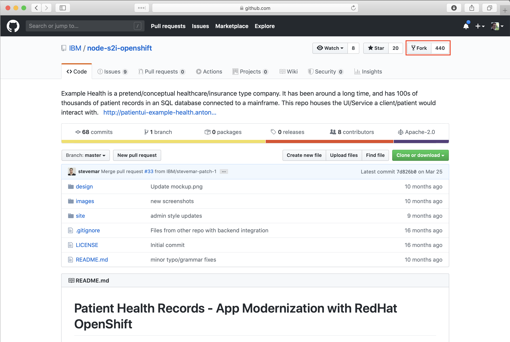

If neccessary, log in with your github.com credentials or sign up for a new account.

---

## Deploy your application using the OpenShift Catalog

To deploy your just-forked repository, go to your OpenShift cluster's Web Console and select the project you created in *Lab 1*.

Click on `+Add` on the top left, then select `From Catalog`:

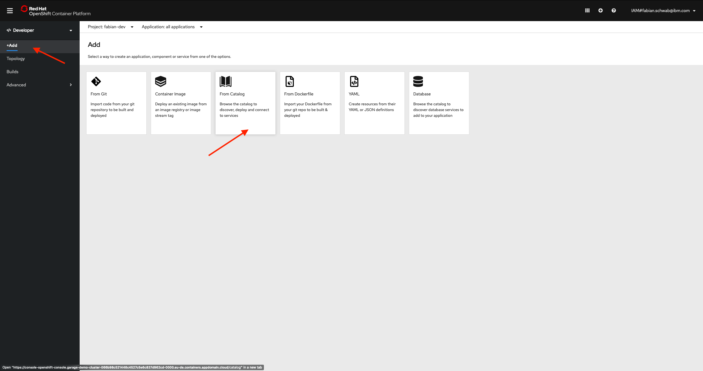

Then filter by `Languages` > `JavaScript` > `Node.js`.

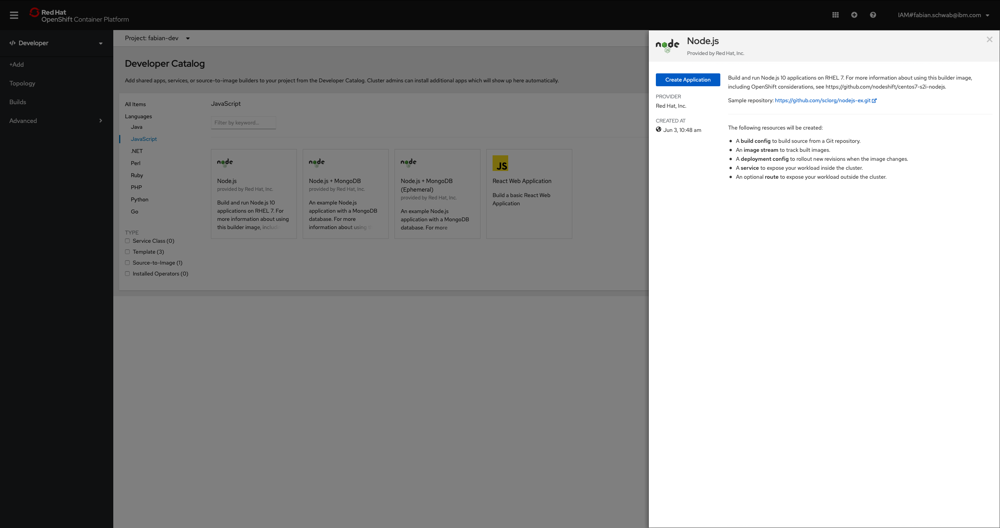

Click `Create Application`. This opens the S2I Node.js template:

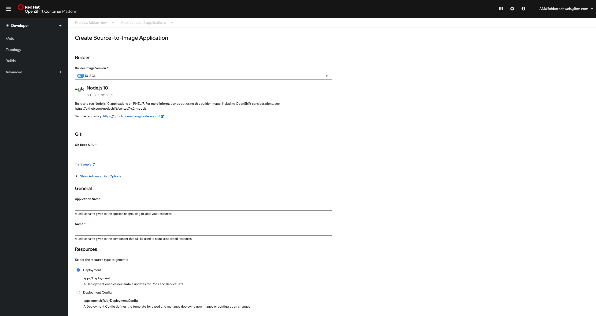

Fill in the following values:

1. Git
    * **Git Repo URL:** `https://github.com/<Account Name>/node-s2i-openshift.git`
    * **Context Dir:** `/site` (therefore expand Show Advanced Git Options)
1. General
    * **Name:** `patient-ui`
1. Advanced Options
    * **Create a rout to the application:** [x] should be checked
    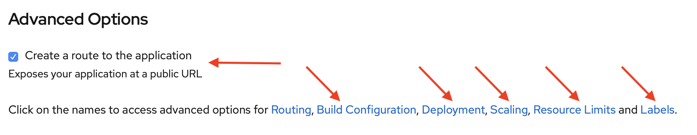
    * **Build Configuration:**  
    Here you can specify when new builds should be launched.  
    [x] `Automatically build a new image when the builder image changes` should only be checked. We will start the first build manually and add a trigger in Lab 4:
    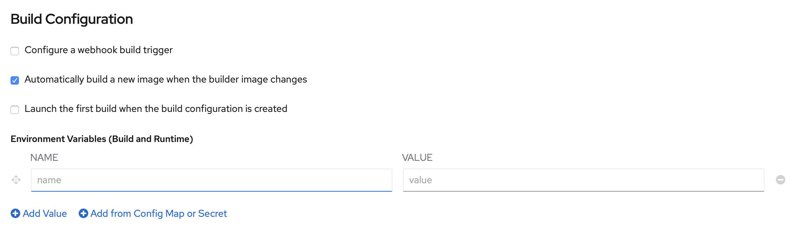
    * **Deployment:**  
    Make sure that the application is automatically deployed when a  
    [x] `New image is available` and the  
    [x] `Deployment configuration changes`.
    * **Scaling:**
    Select `Manual` as scaling strategy and enter `2` for the number of replicas.
    * **Resource Limits:**  
    Limit the amount of memory the container is allowed to use to `200 MB`.
    * **Labels:**  
    You can assign labels to Kubernetes resources to organize, group and select them. This is especially useful when working with many resources in the same project.  
OpenShift will add these labels to all the resources created by this template.
    Add new labels to your application, for example the key `component` and value `frontend`. Please do not change or remove the `app` label:
    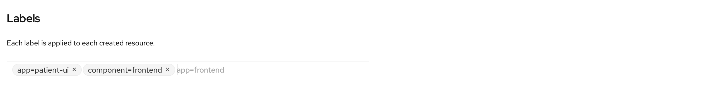

### Create the application

Click `Create` to create the patient-ui application.

 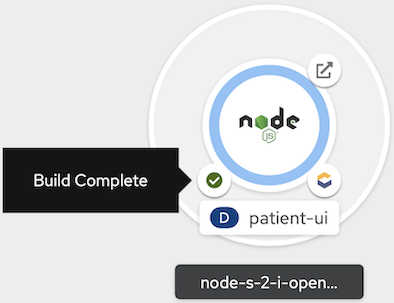

### Explore the Application

On the project overview page click on your newly created application:

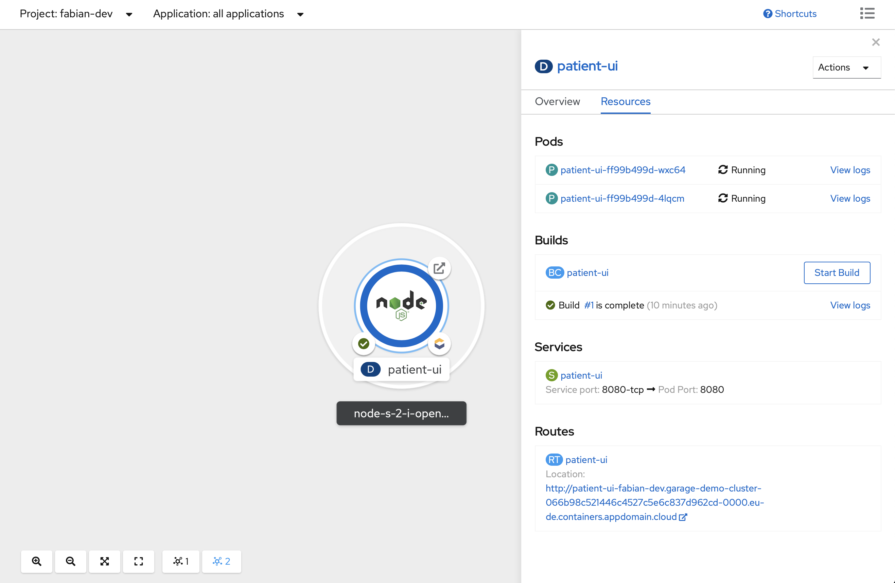

In the Resources Tab you can see the app's related resources: Pods, Builds, Services and Routes.

If you application is not builded after you created it, or you want to start a new build, you can do so on clicking the `Start Build` button.

Try it out an click on `View Logs`. Now you can see the build process running, including build logs.

When the build is completed, make sure that two pods are running, the container is exposing port 8080 and that the service is mapping traffic from port 8080 to 8080. Then click the URL under `Routes` to open your application.

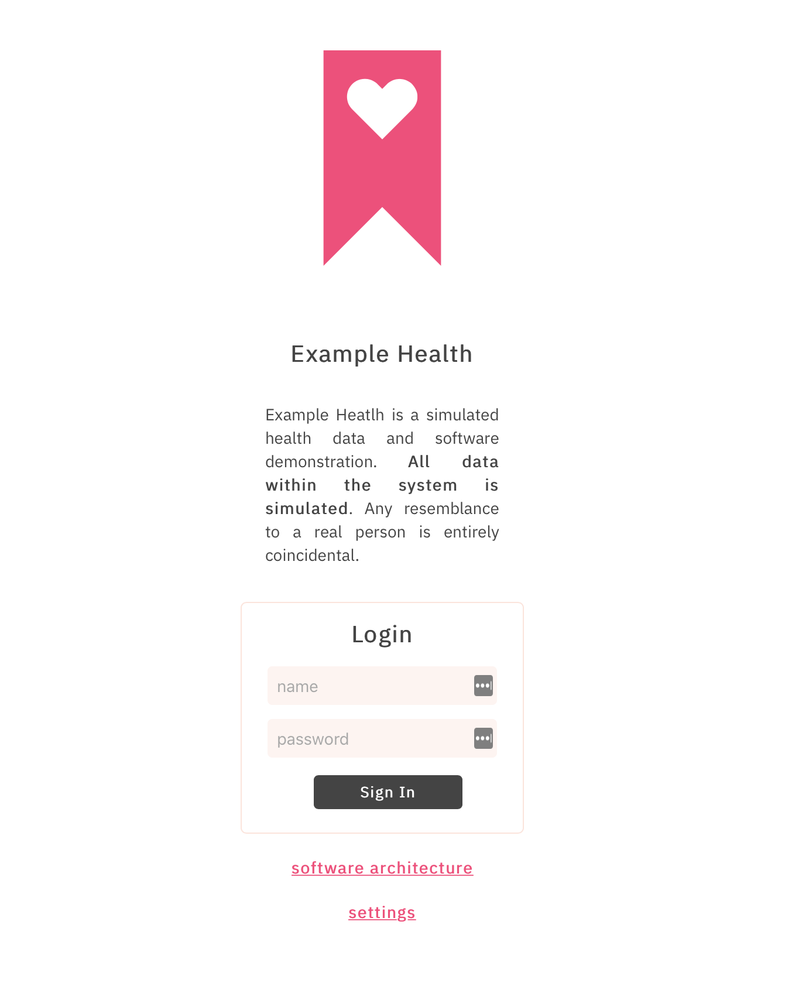

You can log in with any username and password.

---

## Explore the build step

In this section you will explore how container images are built and stored in OpenShift.

A *build* is the process of creating a runnable container image from application source code. A *BuildConfig* resource defines the entire build process. An *image stream* provides a stable, short name to reference a container image to ensure stable deployments and rollbacks.

### Review the Source-to-Image (S2I) build process

Click on the `patient-ui` build within the `Builds` section and take some time to explore the tabs and the first build (click on `#1`) and its logs, which help you to troubleshoot build failures:

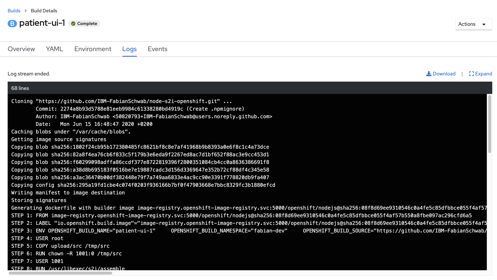

Browse to the `Builds` section of the OpenShift console and click on `patient-ui` build, then click on the `YAML` tab to view the configuration of the `BuildConfig` resource:

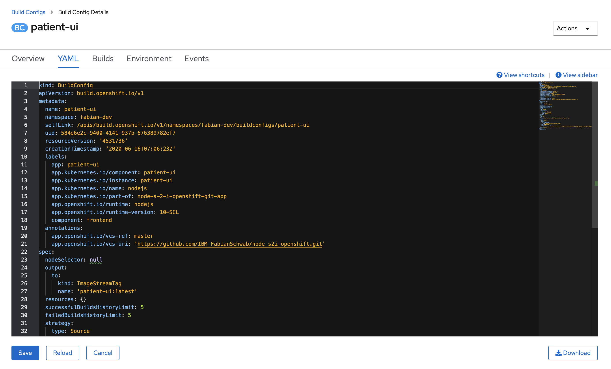

The `BuildConfig` resource describes how container images are built and when these builds are triggered:

* Images are built with the `strategy` of `type: Source` with the `nodejs:10` builder image, which is stored in the project `namespace: openshift`
* A `type: Git` repository stores the application source code
* The `output` image of the build is written to the `name: patient-ui:latest`
* Builds are automatically triggered on `ImageChange` of the `nodejs` builder image

OpenShift can create container images from source code without Docker using the *Source-to-Image (S2I)* tool. The S2I tool builds ready-to-run container images from application source code. Therefore it injects an application's source code into a base container image and, thus, produces a new container images that runs the application. For example the node.js container image already contains the node.js runtime, NPM package manager and other libraries required for running node.js applications.

### Image streams

Having your application's image built, you will now explore where the `patient-ui:latest` image is written to. Therefore click on the left menu `Builds` > `patient-ui` and then select `patient-ui:latest` under `Overview`, `Output To`:

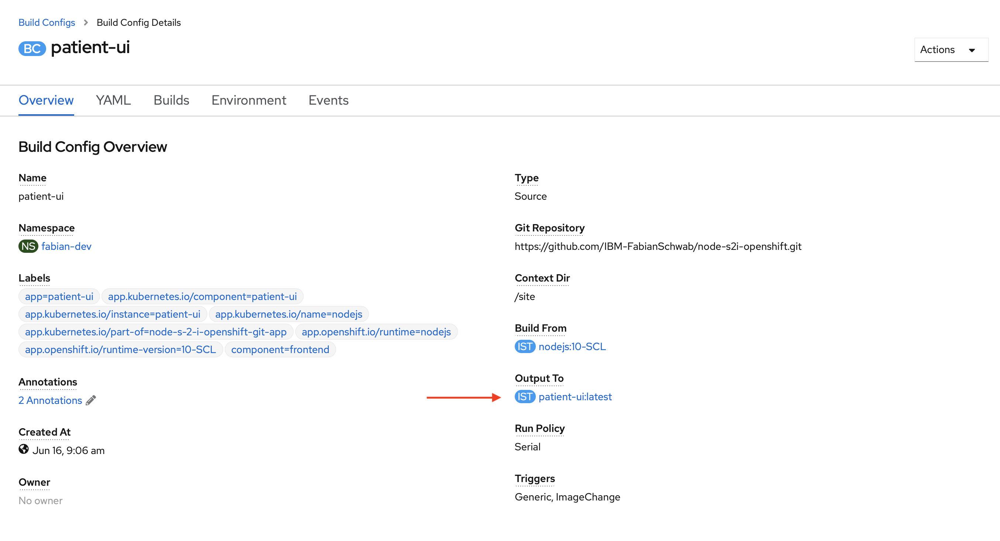

Here you can see the `ImageStream` resource, which comprises container images identified by *image stream tags*.

Click on `patient-ui` on top and select the `YAML` tab to review the resource configuration of the image stream.

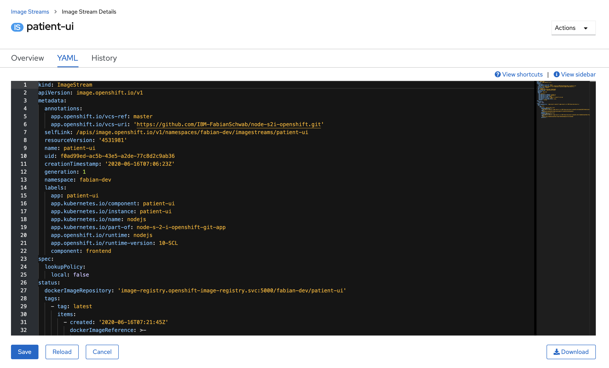

Here you can see the information from the previous screen in the YAML resource file: The `ImageStream` resource contains a list of tags with references to the container images.

In the following chapters and Lab 4 you will see how other components in OpenShift such as builds or deployments watch these image stream to receive notifications when a new image is added and react by performing a build or a deployment.

---

## Explore the deployment step

In this section you will explore how the `patient-ui:latest` image is made available to users and other applications using pods and deployments. You will also learn how to scale deployments by increasing and decreasing the number of pods.

In a *pod* one or more containers are deployed together on one host, and the smallest compute unit in OpenShift. A set of pods is managed by the *DeploymentConfig*. The *DeploymentConfig* embeds a *ReplicationController*, which ensures that the specified number of pod copies (replicas) is running at all times. If pods fail or the specified number increases, new pods are created. If the specified number decreases, pods are terminated.

### Review the application deployment

On the left menu click on `Advanced` > `Project Details`, in the Section **Inventory** select `Deployment` then click on `patient-ui`

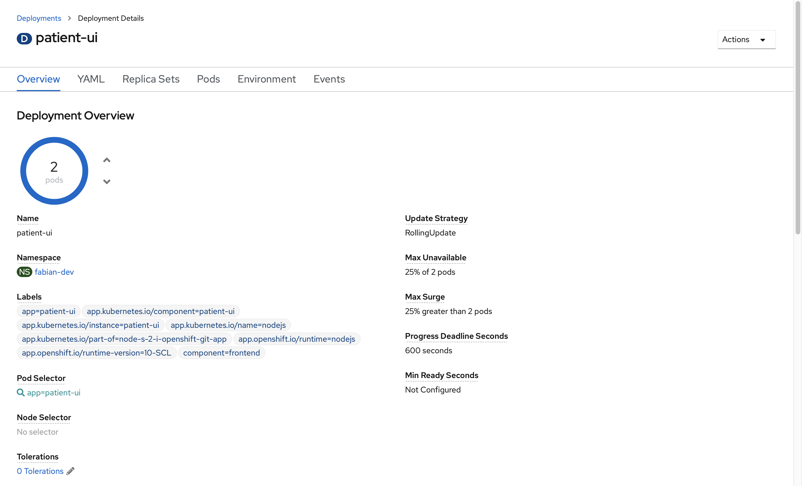

In the `Containers` section you can see that the deployment references the `patient-ui` image of your project, exposes port 8080 and has a 200 MB memory limit.

In the next step we will review the deployment . Therefore scroll up and click again on `YAML`:

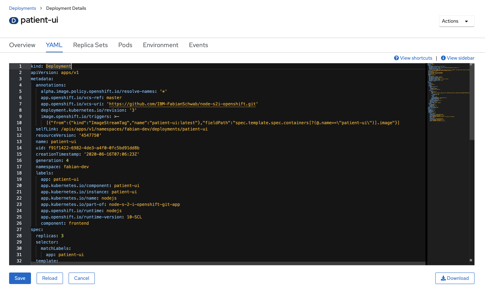

As with the other resources, the `DeploymentConfig` is also specified in a configuration file in which you will find the information you just saw in the Web Console UI:

* There are `2` replicated pods running
* That new versions of the image should be deployed with a `Rolling` update strategy
* The pod runs one container named `patient-ui` with the `.../your-project/patient-ui:latest@sha256...` image
* The container is listening on `port 8080` and limited to `200M of memory`

### Scale the application

At the moment your application is running with two replicated pods. Change `replicas: 2` to `replicas: 3` and click `Save` at the bottom of the page.

Open the `Events` tab. Here you can see that the deployment was scaled from `2` to `3` replicas.

Also in the `Overview` tab you can use the arrows to scale up or down the application.

Click on the `up` and `down` buttons next to `3 pods` to decrease and increase the number of replicated pods.

---

**Make sure that your app is only running with one pod before leaving this screen!**

---

In the `Pods` section you can see how pods that are no longer needed are terminated and how new pods are creating and starting their containers.

Now click on the `Events` tab. Here you can see a list of events with created and deleted Pods.

### Explore the deployment's set of pods

Next we will review the pods where your containers run in. Therefore, click the `Pods` tab to open a page with the Pod's details:

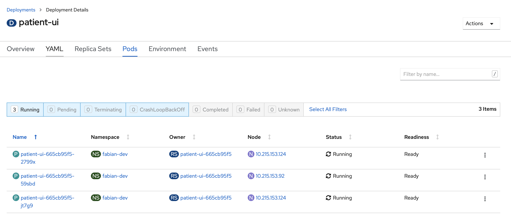

Click on one of the running `patient-ui-...` pods:

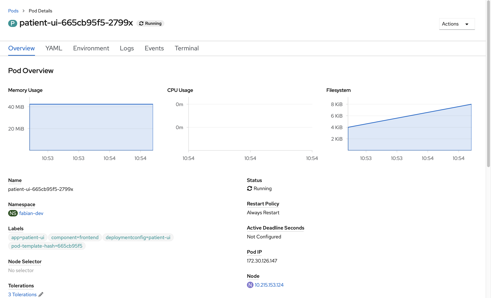

Take some time to explore the tabs – they can help you to troubleshoot applications:

* In the `Logs` tab you can see application logs, for example that the application is actually `Listening on port  8080`.
* In the `Terminal` tab you can run commands inside the container, for example `ls` to see a list of the files S2I injected into the container.
* In the `Events` tab you can see that the Pod *Successfully pulled the image* and *Started the container*.

---

## Routing traffic to containers

While we explored in the previous sections how container images are built and deployed, you will learn how traffic is directed to these pods and containers using services and routes.

A *service* is an abstraction layer which defines a logical set of pods and enables external traffic exposure, load balancing and service discovery. A *route* allows users and applications outside of the OpenShift instance to access the pods over the network.

### Review the service

Click on `Topology` > `patient-ui` got to `Resources`.

In the `Routes` section you can see all routes sending traffic to this service. We will explore the `patient-ui` route in the next chapter.

In the `Pods` section you can see the pods to which traffic directed at the `patient-ui` service is routed to.

Click on the `patient-ui` in the **Services** section

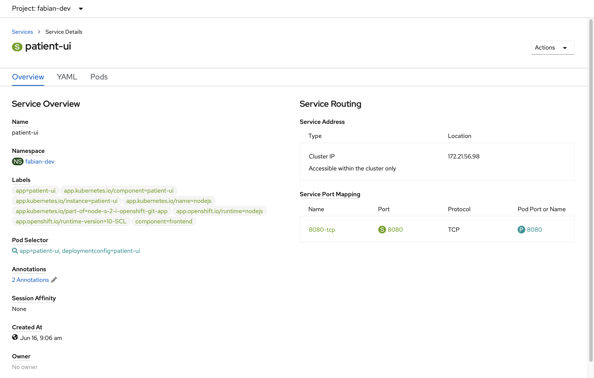

Click on `YAML` to open the service's configuration:

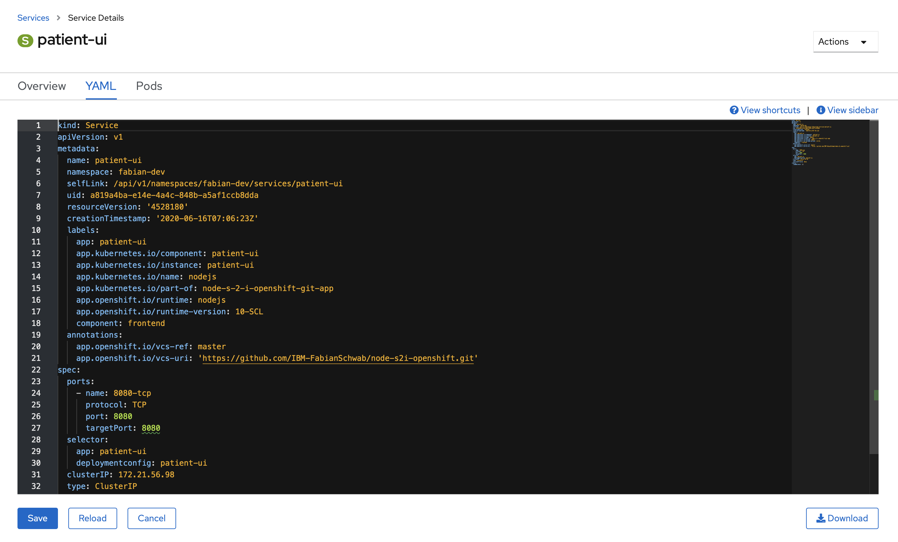

Here you can see that the resource `Service`:

* Has the `name: patient-ui`
* Creates a port named `8080-tcp`, which maps `port: 8080` to `targetPort: 8080` of the `deploymentconfig: patient-ui`
* Is of `type: ClusterIP`, which exposes the service on a cluster-internal IP. This makes the service only reachable from within the cluster!

## Review the route

As the `patient-ui` service is only reachable by other pods within the OpenShift instance, OpenShift added a `Route` to allow external access to the pods.

You can open this route by clickin on `Topology` > `patient-ui` got to `Resources` > **Section Routes** `patient-ui`

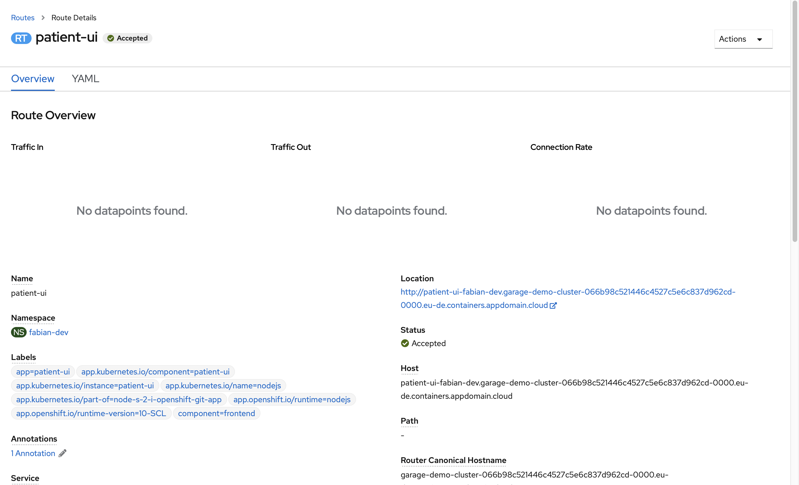

Here you can see that traffic to the root path (`None`) is directed to the service `patient-ui` at the port named `8080-tcp`.

Again, open the route's configuration by clicking `YAML`:

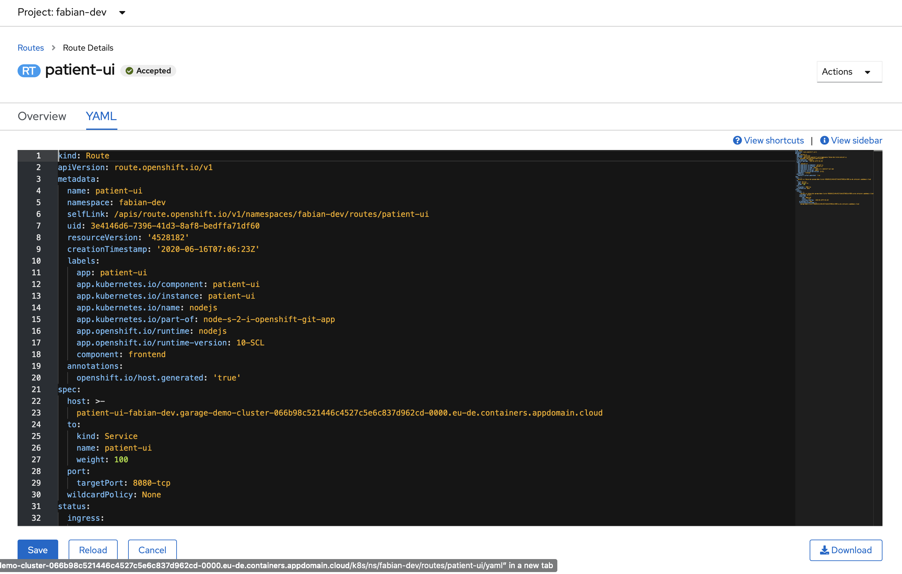

Here you can see that the `Route` resource forwards traffic from `host: patient-...containers.appdomain.cloud` to `kind: Service` with `name: patient-ui` onto `targetPort: 8080-tcp`.

## Conclusion

In this lab we explored how:

* Source code is stored in a git repository
* `Images` are built from the source code using a `BuildConfig` with the `nodejs:10` S2I builder
* The resulting image is stored in an `ImageStream`
* The images run in a set of `Pods`, which are managed by a `DeploymentConfig` and `ReplicationController`
* A `Service` is a virtual abstraction of pods and routes internal traffic to them
* A `Route` exposes the `Service` to the public internet
